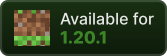
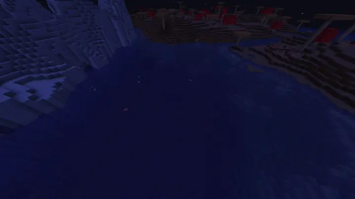

<p align="center">
  
  &nbsp
  
  &nbsp
  <a href="https://modrinth.com/mod/structure-spawn-area-fix"></a>
  &nbsp
  <a href="https://www.curseforge.com/minecraft/mc-mods/structure-spawn-area-fix"></a>
</p>

# Structure Spawn Area Fix

I have noticed an issue with the Alex's Mobs mod, which adds mob spawns to the shipwreck structure.
This structure's bounding box is so small that in practice these mobs will spawn very rarely, if at all.
You can read more about this in [this issue](https://github.com/AlexModGuy/AlexsMobs/issues/2257).

This mod fixes this issue by allowing you to expand the spawn area for mobs around structures.
It does this by checking a larger area around a potential spawn point for a given structure.
If one is found, the biome's regular mob spawns will be overriden with structure-specific ones for this position.

Before, I rarely got a Skelewag to spawn in, but with this fix applied, it looks like this (sped up by a factor of 2; there's a shipwreck in the center of the screen):



## Configuration

The configuration is located in `config/structure-spawn-area-fix.json`.
It is a JSON file containing a list of entries for structures to expand the spawning area for.
Each entry has the following properties:

- `structure`: The namespaced ID of the structure (e.g., `minecraft:shipwreck`)
- `category`: The mob category to apply the expansion for
  - Possible values: `monster`, `creature`, `ambient`, `axolotls`, `underground_water_creature`, `water_creature`, `water_ambient`, `misc`
- `additional_radius`: An integer value that specifies the additional radius to check for the structure in blocks
- `biome` (optional): A namespaced biome ID (e.g., `minecraft:plains`) or a biome tag (e.g., `#minecraft:is_ocean`) to restrict the expansion to specific biomes (recommended for performance).

### Example

Here is an example configuration that expands the spawn area for monsters around shipwrecks by 12 blocks, restricted to biomes that have the shipwreck structure:

```json
[
  {
    "structure": "minecraft:shipwreck",
    "category": "monster",
    "additional_radius": 12,
    "biome": "#minecraft:has_structure/shipwreck"
  }
]
```

By default, the mod creates this exact configuration to fix the issue with Alex's Mobs and its Skelewag spawns at shipwrecks.
If you find other mobs also have issues spawning near structures, you can just add another entry for them.